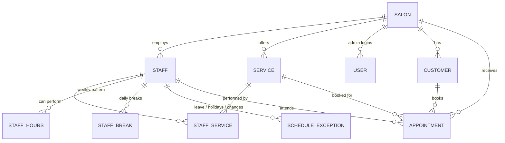
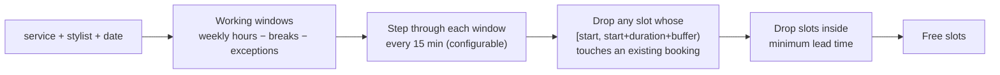

# Goldenhue — V1 Build Plan
White-label online booking for salons

---

## 0. The short version

One codebase, one database, many salons. A salon is a row in the `salon` table plus a slug and its own branding — not a separate deployment. The customer flow is four steps (service → stylist → date & time → details) sitting on top of one server-side availability function. Double bookings are prevented by the database itself rather than by application code, which is the one decision that makes the rest of this simple.

**Benchmark:** the link you shared resolves to a Square Appointments page (Services → Add-ons → Staff → Date → Time → Details). We copy that flow and drop the marketplace around it.

---

## 1. The decision that decides the project: double-booking

Two customers, same stylist, same 10:00 slot, same millisecond. Any code shaped like this is broken:

```js
const free = await checkFree(staff, slot);   // both requests see "free"
if (free) await insertAppointment(...);      // both insert → double booked
```

The check and the insert are not one atomic step, so no amount of care in the application layer fixes it. Application locks fix it until you run a second server instance.

**The fix is one database constraint.** Postgres already knows how to do this:

```sql
CREATE EXTENSION IF NOT EXISTS btree_gist;

ALTER TABLE appointment ADD CONSTRAINT no_double_booking
  EXCLUDE USING gist (
    staff_id WITH =,
    tstzrange(starts_at, buffer_until, '[)') WITH &&
  ) WHERE (status IN ('pending', 'booked', 'confirmed'));
```

What this buys, with no application code:

- Overlapping rows for the same stylist are impossible, even from two processes, two browsers, or a hand-crafted API call.
- The second concurrent insert fails with SQLSTATE `23P01`. The app turns that into *"Sorry, this slot has just been booked. Please select another time."* and refreshes the slot list.
- Buffer time sits inside the range (`buffer_until = ends_at + service.buffer`), so buffers are protected by the same mechanism.
- Cancelling removes a row from the constraint automatically, so the slot reopens.
- Back-to-back bookings still work: `'[)'` means 10:00–12:00 followed by 12:00–12:30 is allowed, 11:59 is not.

Everything below assumes this constraint exists. It is the spine of the product.

---

## 2. Data model



| Table | Holds | Notes |
|---|---|---|
| `salon` | slug, name, timezone, address, phone, currency, brand colours, logo, cover image, slot step, min lead time, booking horizon, cancellation policy, custom domain | The white-label record. Every other table hangs off `salon_id`. |
| `salon_hours` | weekday, open, close, closed | Salon-level opening hours. |
| `staff` | name, title, bio, photo, active, display order | |
| `service` | name, description, category, duration_minutes, buffer_minutes, price_paise, image, active, order | |
| `staff_service` | staff × service | Drives "only stylists who can do this service". |
| `staff_hours` | staff, weekday, start, end (many rows per day allowed) | The weekly pattern. |
| `staff_break` | staff, weekday, start, end | Recurring breaks. |
| `schedule_exception` | staff (nullable = whole salon), date, kind: `day_off` / `custom_hours` / `extra_hours`, start, end, reason | Covers leave, holidays, temporary changes, one-off blocked time. One table, four use cases. |
| `appointment` | salon, staff, service, customer, starts_at, ends_at, buffer_until, status, price snapshot, notes, source | Statuses: `pending`, `booked`, `confirmed`, `cancelled`, `completed`, `no_show`. |
| `customer` | salon, name, phone, email, notes | Per-salon record, so two salons never share a customer. |
| `user` | salon, email, password hash, role (owner / manager / staff), staff_id | Admin logins. |

Two details worth fixing now:

- **Money is integer paise**, never a float.
- **Service price is snapshotted onto the appointment** at booking time, so changing a price later does not rewrite history.

The appointment row is deliberately the only place that records "this time is taken". Nothing is pre-generated, nothing is stored twice.

---

## 3. The availability engine



Slots are **computed on request, never stored**. There is no slot table, no nightly job, no stale rows to reconcile — the database is the single source of truth and the answer is always current.

One SQL function does the work, roughly:

1. Build the day's working windows for the staff member (or, when "any stylist" is selected, for every stylist who can perform the service) from weekly hours, minus breaks, overridden by any exception on that date. A `day_off` exception yields zero windows.
2. Intersect those windows with the salon's opening hours.
3. `generate_series` across each window at the slot step, stopping at `window_end − (duration + buffer)` so a service never runs past closing.
4. Exclude a slot if `tstzrange(slot, slot + duration + buffer, '[)')` overlaps any non-cancelled appointment for that stylist — the exact same range expression as the constraint, so the two can never disagree.
5. Exclude anything before now + lead time, and anything past the booking horizon.

**Timezones:** store `timestamptz`, keep a `timezone` column per salon, and do the day arithmetic with `AT TIME ZONE`. Default `Asia/Kolkata`. India has no DST, but a white-label product will eventually be sold somewhere that does, and this costs nothing today.

**"Any available stylist"** returns one row per free stylist for each slot. When the customer picks one, the server chooses a specific stylist inside the insert; if that insert loses the race, it retries once with the next free stylist for the same slot before giving up. From the customer's side the slot is either booked or genuinely gone.

---

## 4. Customer flow

Four screens plus a confirmation, mobile-first, one URL per salon.

1. **Service** — cards with name, duration, price, photo; grouped by category.
2. **Stylist** — only stylists who perform that service, each with photo and bio, plus an **Any available stylist** option.
3. **Date & time** — a 14-day date strip and a time grid loaded from the availability function. Slots are never rendered from cached HTML.
4. **Details** — name, phone, email, notes. A sticky summary bar shows stylist, service, time and total from step 1 onward.
5. **Confirmed** — booking reference, add-to-calendar, and a cancel link.

Details that matter:

- On `23P01` the customer sees the exact message you specified and the time grid refreshes with the next available slots highlighted. No dead end.
- The form is re-validated server-side; a manipulated frontend only ever produces an insert the database will refuse.
- **Cancel / reschedule** uses a signed HMAC token in the URL, so customers need no account. Cancelling is allowed until the salon's policy cutoff.
- Price and duration are re-read from the database at insert time. The browser's idea of the price is never trusted.

---

## 5. Admin console

| Screen | What it does |
|---|---|
| Today | Today's appointments per stylist, live status, quick actions. |
| Appointments | Day and week view, filter by stylist/status; mark completed / no-show; cancel; reschedule; create a walk-in booking (same insert path, so the constraint applies). |
| Services | CRUD, duration, buffer, price, category, image, ordering. |
| Staff | CRUD, photo, bio, which services they perform. |
| Schedules | Weekly hours editor, breaks, and a calendar for leave, holidays and one-off changes. |
| Settings | Salon hours, branding (logo, colours, cover), booking rules (slot step, lead time, horizon, cancellation cutoff), custom domain, admin users. |
| Customers | List with visit history and notes. |

---

## 6. White-label mechanics

- **Routing:** middleware resolves the request host to a salon — `salonname.goldenhue.co` and `book.goldenhue.co/salonname` both work, plus any custom domain a salon maps. One function, no per-salon build.
- **Theming:** the salon row renders CSS custom properties (`--brand`, `--brand-contrast`, logo, cover) into the page head. No theme engine, no per-salon stylesheet.
- **Isolation:** every query is scoped by `salon_id`; row-level security can be switched on later without changing the schema.
- **SEO:** each booking page emits a title, description and LocalBusiness JSON-LD from salon data.

---

## 7. Stack

| Layer | Choice | Why |
|---|---|---|
| App | Next.js (App Router) — one codebase for booking pages and admin | Server components keep slot data server-side, server actions give the insert path a single choke point. |
| DB | Postgres (Neon or Supabase) | The exclusion constraint and `generate_series` are the product. Both providers allow `btree_gist`. |
| ORM | Drizzle + raw SQL migrations | Needs to coexist with hand-written SQL for the constraint and the slots function. |
| Auth | Email + password, signed session cookie, roles | No third-party dependency for four users per salon. |
| Email | Resend (confirmation + cancellation) | Two templates in V1. |
| Hosting | Vercel + managed Postgres | Wildcard subdomains are a DNS record and a checkbox. |

---

## 8. Build order

**P0 — spine (do this first, it is the risk)**
Schema, exclusion constraint, `available_slots()`, `createBooking()`, and a seed salon with 3 stylists, 4 services and a full week of hours.
*Gate:* 20 parallel bookings for one slot produce exactly one appointment row; the availability tests below pass.

**P1 — customer booking flow**
All five screens, mobile-first, wired to P0 with nothing mocked.

**P2 — admin setup**
Login, services, staff, schedules, salon settings. Until this exists, a salon cannot be onboarded.

**P3 — admin appointments**
Today view, day/week calendar, statuses, cancel, reschedule, walk-in booking.

**P4 — white-label finish**
Branding, subdomain and custom-domain routing, confirmation emails, .ics, cancel links, JSON-LD.

## 9. Tests that actually matter

1. **Concurrency:** N parallel inserts for the same stylist/slot → exactly 1 row. This is the non-negotiable one.
2. **No overlap:** a computed free slot never overlaps a booking, including its buffer.
3. **Boundaries:** a 10:00–12:00 booking leaves 12:00 free and blocks 11:59; nothing ever runs past closing.
4. **Exceptions:** leave and holidays remove a day; `custom_hours` overrides the weekly pattern; breaks carve holes in the working window.
5. **Eligibility:** "any stylist" returns only stylists who perform that service.

## 10. Deliberately out of V1

Online payments and deposits, WhatsApp/SMS reminders, a discovery marketplace, multi-location, add-ons and packages, memberships, tips, inventory, payroll, reviews, waitlists, recurring appointments. Each is additive; none of them change the schema above.

Pending-hold timers (a 10-minute soft lock while the customer fills the form) are also skipped, because a single insert either wins or loses instantly. They become necessary the day a payment step is added, and that is exactly when to add them.

## 11. Defaults I picked

1. No payments in V1 — customers pay at the salon.
2. Email confirmations; WhatsApp/SMS in V1.1.
3. One location per salon record.
4. 15-minute slot step, 60-minute minimum lead time, 60-day booking horizon — all per-salon settings.
5. Only the owner logs into admin; per-stylist logins come with the `user.role` column already in place.

Say the word on any of these and the plan changes before a line of code is written.
